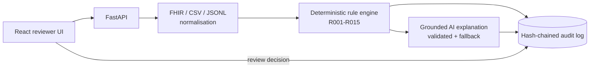

# ClaimGuard AI : Trustworthy Agentic Copilot for Healthcare Claim Pre-Validation

Challenge **CSTAM-VELODOC** (CSTAM 3.0 x Velodoc)

ClaimGuard AI ingests **synthetic** healthcare claim packages (FHIR R4 JSON, CSV, normalised JSONL), validates them against a fictional payer-rule catalogue (R001-R015), explains each finding with evidence-grounded AI, routes uncertain / high-severity cases to a human reviewer, and records everything in a tamper-evident audit log.

> Synthetic data only. The system never makes clinical decisions or approves payment.

## Phase 1 coverage

| Requirement (points) | Where |
|---|---|
| Data ingestion & normalisation (15) | `backend/src/normalisation/`, `api_app/services.py` -> [docs/INGESTION.md](docs/INGESTION.md) |
| Deterministic & AI rule engine (15) | `backend/src/rule_engine/`, `backend/src/AI_agent/` -> [docs/RULES_CATALOGUE.md](docs/RULES_CATALOGUE.md) |
| Explainability & structured output (10) | [docs/FINDINGS_SCHEMA.md](docs/FINDINGS_SCHEMA.md) |
| Audit log engine (10) | `backend/src/audit/` -> [docs/AUDIT_LOG.md](docs/AUDIT_LOG.md) |
| Architecture & data flow | [docs/ARCHITECTURE.md](docs/ARCHITECTURE.md), [docs/DATA_FLOW.md](docs/DATA_FLOW.md) |

## Architecture in one picture



Key idea: **rules decide, AI explains.** The LLM cannot change a verdict, severity or the human-review flag; invalid output is replaced by a deterministic fallback.

## Tech stack

Python 3.11+, FastAPI, Pydantic, Uvicorn, SQLite, OpenAI-compatible client (works with NVIDIA NIM / OpenAI) - React, TypeScript, Vite.

## Prerequisites

- Python 3.11+
- Node.js 18+ and npm

## Installation and run

### Backend

```bash
cd backend
python -m venv .venv
source .venv/bin/activate        # Windows: .venv\Scripts\activate
pip install fastapi uvicorn pydantic openai python-dotenv httpx pytest   # or: pip install -r requirements.txt
cp .env.example .env             # optional: add your API key
python src/api.py --host 127.0.0.1 --port 8000
```

API docs: http://127.0.0.1:8000/docs - health: `GET /api/v1/health`.

Without `OPENAI_API_KEY` the explanation layer uses the deterministic mock provider, so everything works offline.

`.env` variables:

| Variable | Purpose |
|---|---|
| `OPENAI_API_KEY` | LLM key (optional) |
| `OPENAI_BASE_URL` | OpenAI-compatible endpoint (e.g. `https://integrate.api.nvidia.com/v1`) |
| `OPENAI_MODEL` | Model name |
| `CLAIMGUARD_AUDIT_LOG` | Audit log path (default `outputs/audit_log.jsonl`) |
| `CLAIMGUARD_CORS_ORIGINS` | Comma-separated allowed origins |

### Frontend

```bash
cd frontend
npm install
echo "VITE_API_BASE_URL=http://127.0.0.1:8000" > .env.local
npm run dev
```

Open http://localhost:5173.

### Command-line tools

```bash
cd backend
python src/run_baseline.py --input data/development/claims.jsonl --output outputs/predictions.jsonl
python src/evaluate.py --help
python src/AI_agent/explain_rule_results.py --input outputs/predictions.jsonl --output outputs/explanations.jsonl
python src/audit/audit.py --log outputs/audit_log.jsonl      # verify audit chain
```

### Tests

```bash
cd backend
python -m pytest tests
```

## Quick check

```bash
curl http://127.0.0.1:8000/api/v1/health
curl http://127.0.0.1:8000/api/v1/audit/verify
```
Then use the **Ingest** page of the UI (all endpoints are in [docs/API_REFERENCE.md](docs/API_REFERENCE.md)).

## Project structure

```
backend/
  src/
    api.py                 # uvicorn launcher
    api_app/               # FastAPI app, routes, schemas, services
    normalisation/         # fhir_adapter, csv_to_jsonl, schema_subset
    rule_engine/           # engine_core (R001-R015)
    AI_agent/              # llm_adapter, confidence, explain_rule_results
    audit/                 # hash-chained audit log
    run_baseline.py, evaluate.py, make_review.py
  rules/  schemas/  data/  # rule catalogue, claim schema, datasets
  tests/
frontend/
  src/{api,components,hooks,pages}
docs/
```

## Known limitations (Phase 1)

- Rules are deterministic only; AI explains but does not detect.
- Confidence scores are heuristic, not calibrated.
- No authentication yet (reviewer id taken from `X-Actor` / request body) - planned for Phase 2 with RBAC.
- Audit chain is tamper-evident, not tamper-proof.

## Team

-Marwen Agrebi
-Aya Gaha
-Ines Mtibaa
-Kmar Ben Ayed