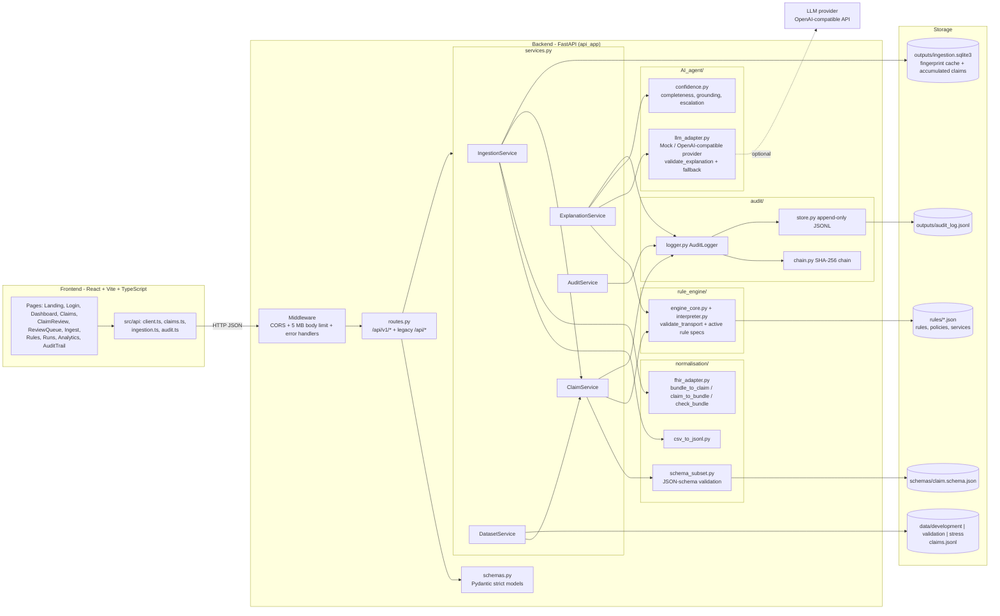
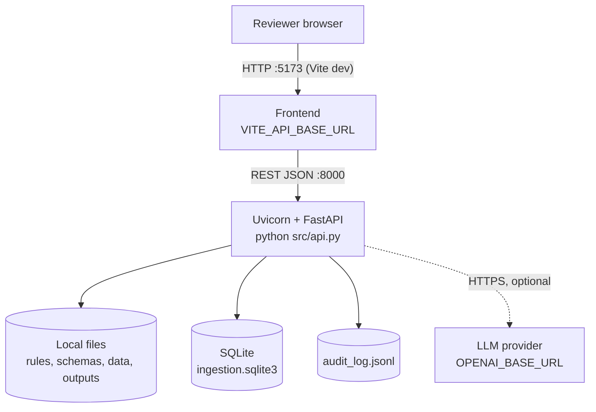
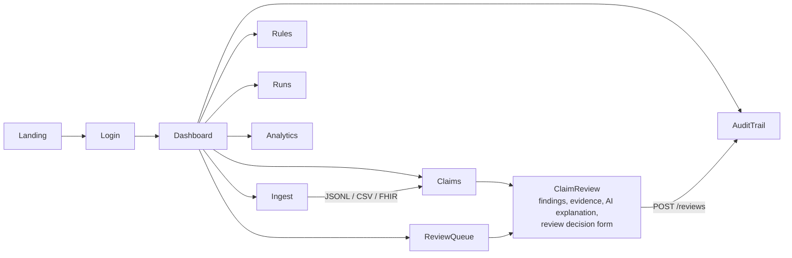

# ClaimGuard AI Source Architecture

## 1. Design principles

1. **Deterministic rules decide, AI only explains.** The verdict (`PASS/FAIL/UNABLE_TO_ASSESS/NOT_APPLICABLE`) always comes from the rule specs, evaluated by `rule_engine/interpreter.py`. The LLM can never change a status, severity or the `requires_human_review` flag. When a model drafts a *new* rule, it only proposes a spec; code checks it before it runs ([RULE_ENGINE.md](RULE_ENGINE.md)).
2. **Nothing is invented.** Missing data stays `None`, which yields `UNABLE_TO_ASSESS` (low confidence, human review) instead of a guessed default.
3. **Every action is audited** in a hash-chained, append-only log. If the audit write fails, the request fails (HTTP 503) rather than proceeding unlogged.
4. **Human in the loop.** Failing / uncertain findings are routed to a reviewer who records one of four actions with a mandatory reason.
5. **Graceful degradation.** No API key, LLM timeout or invalid LLM output falls back to a deterministic explanation.

## 2. Component diagram

## 3. Layer responsibilities

| Layer | Module | Responsibility |
|---|---|---|
| API | `api_app/main.py` | App factory, CORS, 5 MB body limit, uniform JSON errors `{error, code}` |
| API | `api_app/routes.py` | Versioned routes (`/api/v1`) plus legacy `/api/*` compatibility routes |
| API | `api_app/schemas.py` | Strict Pydantic request models (`extra="forbid"`, rule-id regex, review actions enum) |
| Service | `api_app/services.py` | `IngestionService`, `ClaimService`, `DatasetService`, `ExplanationService`, `AuditService`, `IngestionStore` (SQLite) |
| Normalisation | `normalisation/fhir_adapter.py` | FHIR R4 Bundle <-> internal claim envelope, structural checks that never raise |
| Normalisation | `normalisation/csv_to_jsonl.py` | Rebuilds claims from 5 relational CSV files |
| Normalisation | `normalisation/schema_subset.py` | Lightweight validation against `claim.schema.json` |
| Rules | `rule_engine/engine_core.py` | Transport validation, running the active rule specs, evidence pointers, confidence heuristic |
| Rules | `rule_engine/language.py`, `validation.py`, `interpreter.py`, `spec_store.py` | The rule language, its static checks, its evaluator and versioned spec storage |
| Rule authoring | `rule_authoring/*` | Drafter agent, edge cases, oracle, checks and workflow for new rules ([RULE_ENGINE.md](RULE_ENGINE.md)) |
| AI | `AI_agent/llm_adapter.py` | Grounded explanation providers, output validation, deterministic fallback |
| AI | `AI_agent/confidence.py` | Evidence completeness, citation grounding, escalation reasons, review priority |
| Audit | `audit/*` | SHA-256 hash chain, thread-safe logger, fsync'd append-only JSONL store |
| UI | `frontend/src/pages/*` | Reviewer interface (queue, claim review, ingestion, audit trail, analytics) |

## 4. Deployment / runtime view

## 5. Frontend page map

