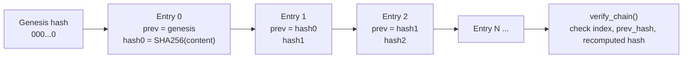

# Audit Log Engine

Implementation: `backend/src/audit/`  append-only JSONL, SHA-256 hash chain.

## Entry format

| Field | Description |
|---|---|
| `index` | Sequential position starting at 0 |
| `timestamp` | UTC ISO-8601 |
| `event_type` | `rule_execution`, `ai_decision`, `human_decision` |
| `claim_id` | Claim concerned |
| `actor` | `system`, `ai`, or the reviewer id (`X-Actor` header / request) |
| `payload` | Event-specific data (see below) |
| `prev_hash` | Hash of previous entry (`"0"*64` for genesis) |
| `entry_hash` | `SHA256(canonical_json({index, timestamp, event_type, claim_id, actor, payload, prev_hash}))` |

### Payloads

- `rule_execution`: `evaluation_id, rule_id, rule_version, status, severity, requires_human_review, confidence, confidence_kind, method`
- `ai_decision`: `rule_id, provider, finding_hash, fallback_used, explanation, assessment{explanation_source, evidence_completeness, explanation_grounding, review_priority, escalate, escalation_reasons}`
- `human_decision`: `rule_id, action, original_status, decision_timestamp, reason_hash` (free-text reason is stored only as a SHA-256 hash: data minimisation)

## Chain

## Guarantees and behaviour

- **Tamper evidence:** editing, deleting or reordering any line breaks `verify_chain`; `GET /api/v1/audit/verify` returns `{valid, first_broken_index}`.
- **Durability:** each batch is written with `flush()` + `os.fsync()`.
- **Concurrency:** a thread lock serialises chain extension.
- **Fail closed:** if the existing chain is invalid at startup, `AuditLogger` raises `AuditIntegrityError`; if a write fails, the API returns `503 audit_unavailable`.
- **Read API:** `GET /api/v1/audit/events?limit=` returns an allow-listed projection of each payload.
- **CLI:** `python src/audit/audit.py --log outputs/audit_log.jsonl` verifies the chain.

Limitation : hash chaining is tamper-*evident*, not tamper-*proof*; an attacker with file write access could rewrite the whole chain. We will be anchoring the head hash externally would close this.