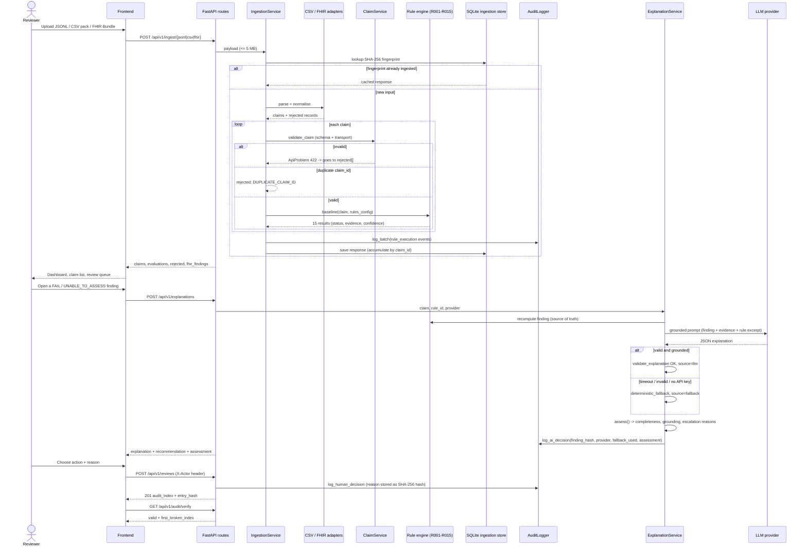
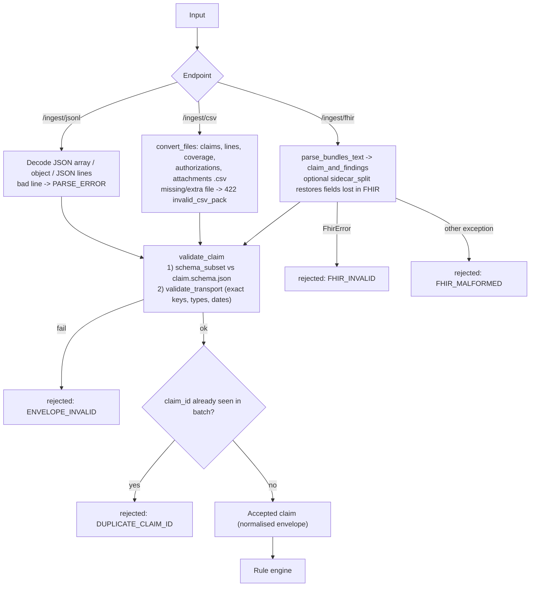
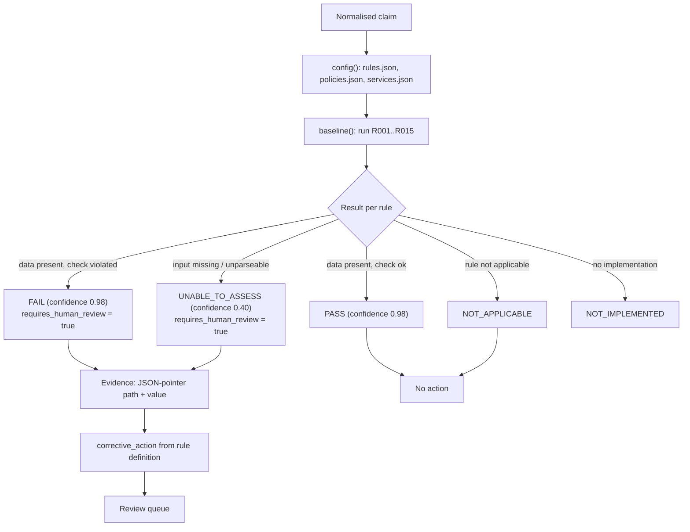
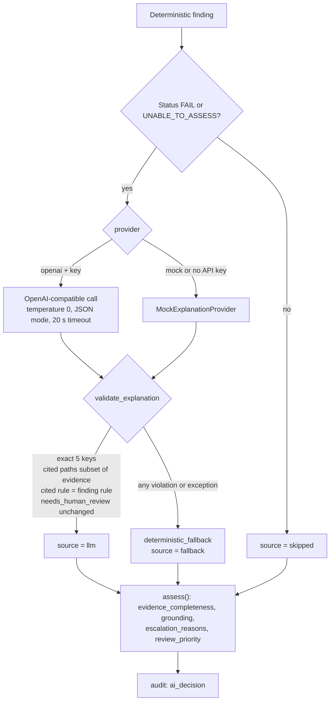
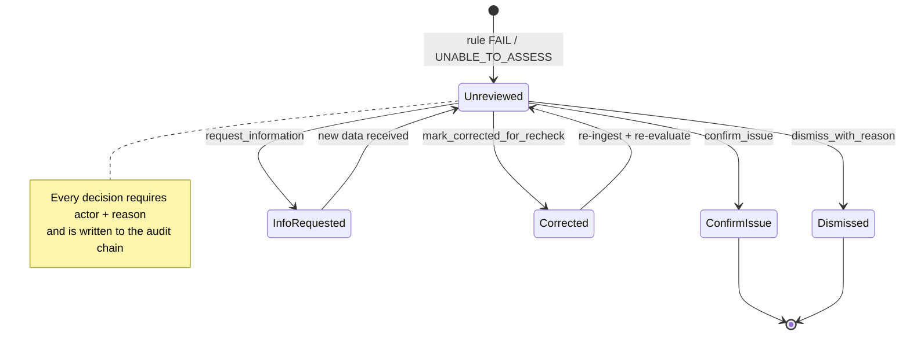

# ClaimGuard AI Data Flow

## 1. End-to-end flow: ingest, validate, explain, review, audit

## 2. Ingestion and normalisation

Normalised claim envelope (exact key set enforced by `validate_transport`):
`schema_version, claim_id, invoice_number, patient_id, member_id, provider_id, payer_id, policy_id, diagnosis_code, submission_date, currency, total_amount, coverage, lines[], authorizations[], attachments[], notes`.
Line keys: `line_id, service_code, service_date, modifier, quantity, unit_price, net_amount, authorization_id`.

## 3. Rule engine and escalation

`confidence_kind` is `"uncalibrated"`: the 0.98 / 0.40 values are a certainty heuristic, not a probability.

## 4. AI explanation guardrails

Prompt-injection posture: claim fields, notes and attachment text are declared untrusted in the system prompt; the model may not approve payment, infer clinical necessity or accuse of fraud.
Escalation reasons: `not_implemented`, `high_severity`, `low_evidence_completeness` (< 0.5), `ai_explanation_failed`, `weak_grounding` (< 0.5).

## 5. Human review loop

