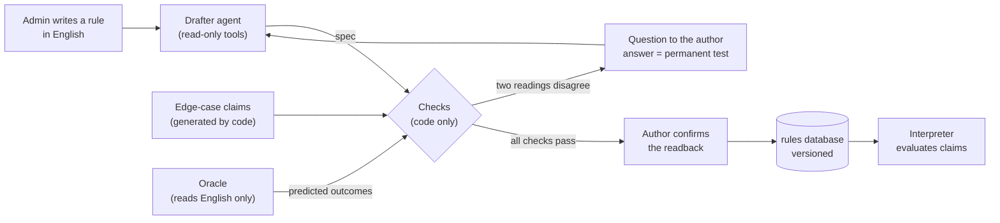

# Rule engine and rule authoring

Rules are **data, not code**. Every active rule is a small JSON spec that the server
evaluates itself. A language model can *propose* a spec for a new rule written in
English, but only plain code decides whether it may run.



## 1. Running rules

| Piece | File | Role |
|---|---|---|
| Rule language | `backend/src/rule_engine/language.py` | Pydantic models: the exact shape of a spec. One definition for checking and evaluating. |
| Static checks | `rule_engine/validation.py` | Fields exist in `claim.schema.json`, names are defined, types fit, limits on size and nesting. |
| Interpreter | `rule_engine/interpreter.py` | Evaluates a spec on one claim with three-valued logic and an operation budget. |
| Readback | `rule_engine/readback.py` | Renders a spec as plain English, with a fixed template (no AI). |
| Spec store | `rule_engine/spec_store.py` | One SQLite database (`outputs/rules.sqlite3`): every revision (append-only), and which one is active. It scales to thousands of rules in a single file. |
| Reference seed | `rules/reference_specs.json` | The 15 reference specs in one reviewable file, loaded into the database automatically. |
| Runtime | `rule_engine/engine_core.py` | `config()` loads the active specs and `baseline()` runs them. One failing rule gives `UNABLE_TO_ASSESS`, never an error. |

The full language reference, with examples, is
[`backend/src/rule_authoring/prompts/rule_language.md`](../backend/src/rule_authoring/prompts/rule_language.md).
The drafting model is given the same text, so the documentation and the model's
instructions cannot drift apart.

### Safety properties

- **No code is generated or executed.** A spec is parsed into fixed Pydantic models.
  Paths cannot index arrays and there is no null literal; there is no `eval`, no regex
  and no file access.
- **Specs are bound to their text.** Each stored spec records the SHA-256 of the
  English logic it implements. If `rules.json` is edited by hand, the rule stops
  running (it becomes inactive) rather than running old logic.
- **Specs are re-checked on every load.** A corrupted or hand-edited stored spec that
  fails the checks is inactive, with the reason reported by `GET /api/v1/rules`.
- **History cannot be rewritten.** Database triggers forbid `UPDATE` and `DELETE` on
  stored revisions. Deactivating only removes the "active" pointer.
- **Reference specs come from the seed file.** A rule with no history gets the seed as
  revision 1. When the seed changes, reference rules get a new revision, but a rule an
  admin has revised or deactivated is left alone.
- **Drafted rules live only in the database.** `rules.json` lists them, but their specs
  are in `outputs/rules.sqlite3`. If that file is lost, those rules become inactive
  (they fail safe) until they are re-drafted, so back the file up with the audit log.
- **Bounded evaluation.** There is a 200,000-operation budget per rule and claim,
  and decimal arithmetic where overflow becomes "unknown".
- **Missing is never PASS.** A condition that needs a missing or invalid value is
  unknown, which gives `UNABLE_TO_ASSESS` and a human review.

## 2. The reference rules R001–R015

R001–R015 were rewritten as specs by hand (`origin: "reference"`) and proven against
the original Python rules:

- **9,000 / 9,000** expected outcomes reproduced (development, validation and stress
  splits; `tests/test_reference_specs.py`).
- The same status as the original Python rules on **3,000 seeded mutated claims**
  (45,000 rule checks covering missing values, boundary dates and amounts, unknown
  codes and duplicates).

**One intentional difference (R009).** When two authorization records share the same
id, the original code silently used the last one. The reference spec returns
`UNABLE_TO_ASSESS` so that a human resolves the ambiguity. No dataset claim has
duplicate authorization ids.

The original Python is kept in `rule_engine/legacy_rules.py` as a **reference only**:
it is used by the tests above and is not on the runtime path.

## 3. Authoring a rule

| Piece | File | Role |
|---|---|---|
| Drafter | `backend/src/rule_authoring/drafter.py` | Agent loop. Each turn the model sends one JSON action: `check`, `try`, `ask_author`, `propose` or `unsupported`. |
| Edge cases | `rule_authoring/edge_cases.py` | Test claims generated by code from the fields and values that the draft reads. |
| Oracle | `rule_authoring/oracle.py` | A separate model call that predicts outcomes from the English text only; it never sees the spec. |
| Checks | `rule_authoring/checks.py` | The gates listed below, with the readback and an impact preview. |
| Workflow | `rule_authoring/service.py`, `drafts.py` | The draft state machine, author questions, activation and audit. |
| API | `backend/src/api_app/rule_routes.py` | `/api/v1/rules`, described below. |
| UI | `frontend/src/components/RuleManager.tsx` | Admin Panel, "Validation Rules" tab. |

### What the drafter can do

The drafter receives the rule text (as quoted data), the claim field catalogue, the
names of the reference data and the language reference. Its tools only read: they
check a spec, or run it on generated test claims. It cannot write files, activate a
rule, choose a rule id or see the dataset. Each session has fixed budgets: 10 turns,
3 invalid replies and 5 minutes.

### The checks (all code)

1. **fields_and_types**: every field exists and every comparison has fitting types.
2. **author_examples**: every outcome the author confirmed is reproduced exactly.
3. **independent_reading**: on every generated edge case, the spec agrees with the
   oracle. A case the oracle reads differently is asked again on its own. If the oracle
   then changes its mind, the case is *inconclusive* (noise from a small model, not
   evidence); at most a quarter of the cases may be inconclusive. On a claim the author
   has already answered, the author's answer replaces the oracle.
4. **not_constant**: the outcome varies across cases; a rule that cannot change is
   almost certainly misread.
5. **dataset_dry_run**: the spec runs on all development claims without errors.

When only the two readings disagree, the author is asked about the concrete test claim
(up to 3 at a time), and each answer is stored as a permanent test for that rule. The
draft is **rejected**, because it cannot be verified, when:

- the oracle is unavailable;
- the oracle is too unstable (more than a quarter of the cases are inconclusive);
- the readings still disagree after 6 questions, which usually means the rule text is
  ambiguous and should be reworded.

### Working with a small, free model

The pipeline is built to run on a small model (by default the free
`llama-3.2-11b-vision-instruct` on NVIDIA's endpoint). A weaker model never weakens
safety: everything it produces goes through the same checks, so a poor answer is
rejected, not activated. What it changes is how often a draft succeeds. These measures
help a small model:

- **Format slips are repaired or retried, never fatal.** A reply wrapped in prose or code
  fences, or missing its last closing brackets, is repaired. Other malformed replies are
  sent back to the model with the problem, within the invalid-reply budget. `intent` and
  `assumptions` placed inside the spec are moved next to it.
- **The oracle gets a small input**: three claims per call, with only the policies and
  services those claims use.

### Draft states

`queued → drafting → checking → awaiting_confirmation → active`. A question leads to
`awaiting_author`, then back to `queued` once answered. Any open draft can end as
`rejected` or `cancelled`. A draft that was running when the server stopped is
rejected on restart.

### Activation

- The audit event is written **before** the rule takes effect. If the audit log is
  unavailable, the rule is not activated.
- The spec is re-checked against the current files right before activation.
- Rule ids are assigned by the server (`R` + digits, no upper limit) and never
  reused, not even after deletion or rejection.
- The rule is live immediately, with no restart. The kill switch is
  `POST /api/v1/rules/{id}/deactivate`.

### Author confirmation

By default (`RULE_REQUIRE_AUTHOR_CONFIRMATION=true`), a draft that passed every check
waits for the author to confirm the plain-English readback. Fully automatic activation
can be switched on. Decide this from the benchmark below, which measures how often the
checks would accept a wrong rule.

## 4. API

| Method | Path | Admin token | Purpose |
|---|---|---|---|
| GET | `/api/v1/rules` | no | Catalogue with status (active / inactive and why) |
| GET | `/api/v1/rules/{id}` | no | Rule, active spec, readback, history |
| POST | `/api/v1/rules/drafts` | yes | Submit `{title, severity, logic, corrective_action, rule_id?}` (202, drafted in the background) |
| GET | `/api/v1/rules/drafts`, `/drafts/{draft_id}` | yes | Drafts and their reports |
| POST | `/api/v1/rules/drafts/{draft_id}/answers` | yes | `{question_id, answer}` |
| POST | `/api/v1/rules/drafts/{draft_id}/confirm` | yes | Activate a draft that passed every check |
| POST | `/api/v1/rules/drafts/{draft_id}/cancel` | yes | Cancel an open draft |
| POST | `/api/v1/rules/{id}/deactivate` | yes | Kill switch |

`rules.json` can no longer be saved through `/api/v1/config` (409), and every config
save now needs the admin token.

## 5. Configuration

| Variable | Default | Purpose |
|---|---|---|
| `CLAIMGUARD_ADMIN_TOKEN` | unset, so admin changes are **disabled** | Shared token (at least 16 characters) sent as `X-Admin-Token` |
| `CLAIMGUARD_RULES_DB` | `outputs/rules.sqlite3` | Rule spec and draft database |
| `RULE_DRAFTER_MODEL` | `OPENAI_MODEL` | Model for the drafter (should be good at following JSON instructions) |
| `RULE_ORACLE_MODEL` | the drafter model | Preferably a **different** model (another free one on the same endpoint works), so the two readings do not share blind spots |
| `RULE_REQUIRE_AUTHOR_CONFIRMATION` | `true` | `false` activates automatically when every check passes |
| `RULE_DRAFTS_PER_HOUR` | `20` | Rate limit on submitted drafts |

Without `OPENAI_API_KEY`, drafts are rejected and nothing is activated.

## 6. Benchmark

```bash
cd backend
python src/run_rule_benchmark.py --set all --out outputs/rule_benchmark.json
```

This runs the real pipeline (it **uses model calls**) on the English text of R001–R015
and on 20 invented rules (`src/rule_benchmark/invented_rules.json`), including one rule
the language cannot express. Questions are answered by a simulated author who knows the
correct behaviour. Each final proposal is compared with the reference on the dataset,
1,000 mutated claims and the boundary cases of both specs. The key output is
`wrongly_accepted`: rules that passed every check but behave differently from the
reference.
